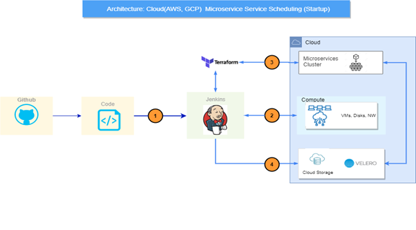
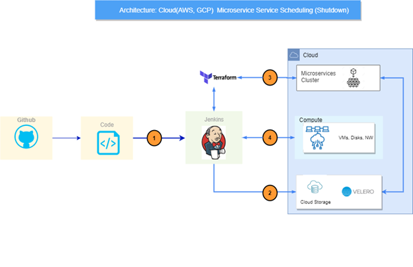

# Cloud Scheduler

## Inspiration for the product

Nowadays, organizations are depending upon the cloud computing technology offered by various cloud providers in the market. The Organization’s operations and usage entirely depend on the services provided by the various cloud providers and vendors. As the usage of services increases the cloud costs will also increase. Our team has noticed that many organizations are nowadays keeping up and running their cloud resources for non-production environments during non-business hours. So, the organizations are paying for the non-usage which is being idle.

## Our Approach

We as a team came up with an approach called predictive cloud capacity management and ended up with a solution named **cloud-scheduler**. We assume that the organization has some of the cloud resources being idle during non-business hours for the non-production environment like sandbox, Dev, UAT, and staging. So we developed a solution for this limitation to reduce the organization’s cloud costs by 25%-50% monthly. Here, The Cloud Scheduler is mainly designed and developed to reduce the organization’s cloud costs.

 1. Scheduling the resources as per required time zones through Cron Job
    in an automated way.
 2. Scheduling the container-based and compute-based resources in the
    cloud which are created through automation by using IaaC tools.
 3. After creating the cloud resources through Iaac tools. Scheduling or
    destroying the cloud resources will take place through the cloud
    scheduler.
 4. Later, we will take a backup using open-source tools mainly called
    as disaster recovery management tools.
 5. After taking the backup the files are compressed and stored in the
    default location of the cloud. Whenever the resources need to be up
    and run then we will restore them using these backup files.

## Design Overview
The design Overview of our solution and approach is categorized into two different sections.

**Startup and Shutdown through Automation:**

## Product Functionalities
Cloud resources are always running unless customers specifically shut down, which means customers are paying for computing time they don’t use. We as a Digital Innovation Centre Team considered this as a limitation so we designed and developed the scheduler to schedule the cloud resources that can be implemented on any cloud provider.

We as a team came up with three different categories for this solution.

1. Cloud Resources Scheduling
2. Backup and Restore of the cloud resources.
3. Scheduling the container-based services.

## Steps for building
Firstly, our main approach is to reduce the monthly cloud costs of the organizations by 25%-50% by implementing our solution. We categorized our solution into four sections which will be productive and flexible to manage the cloud resources and reduce the cost.

1. **Scheduling Compute Services:** In this section, we are scheduling the compute services based on the required time zones by using the Cron Job in an automated way. Here we use IaaC tools for provisioning Infrastructure.
2. **Scheduling Container-based Services:** In this section, we are creating and scheduling container-based services like clusters in an automated way using IaaC tools.
3. **Taking backup and restoring:**  Before destroying the cloud resources we are taking backup of those resources using open-source tools and disaster recovery management tools.
4. **Destroying the resources by taking backup:**  Finally, we destroy the resources during non-business hours by taking backup of the environment and restoring it whenever required using disaster recovery management tools in an automated way using IaaC tools.

## Challenges we faced

Though we are scheduling the cloud resources we faced some problems while taking backup of the environment and restoring it. We also faced some authentication errors as we are developing this solution in an automated way. We as a team also faced some issues while integrating all the infrastructure provisioning tools and disaster recovery management tools with separate environments and parameterized into three different ways as we are developing for various cloud providers. The above-mentioned challenges are what we have faced to come up with a solution.

## Expectations in upcoming versions

As of now we mainly focused on computing and container-based services to schedule them as those services mainly impact for highest cloud costs. In the Upcoming version, we will improve the current version and will also come up with a solution for the remaining cloud resources.

## Built with

Cron Job, IaaC Templates, Groovy script, Jenkins, Terraform, and Velero.

## Try it out

Try this solution by using the provided installation and setup guide.

Installation guide - [Installation Guide.docx (sharepoint.com)](https://criticalrivertechnologies.sharepoint.com/:w:/r/sites/DevSecOps/_layouts/15/Doc.aspx?sourcedoc=%7BC38C9F35-D4A7-43A0-B5E8-78923F35F0FE%7D&file=Installation%20Guide.docx&action=default&mobileredirect=true)

## Related Documents
- Scheduler Release notes 1.0: [Scheduler Release notes 1.0.docx (sharepoint.com)](https://criticalrivertechnologies.sharepoint.com/:w:/r/sites/DevSecOps/_layouts/15/Doc.aspx?sourcedoc=%7B25160382-A88B-4E1A-A6FA-310DB051C479%7D&file=Scheduler%20Release%20notes%201.0.docx&action=default&mobileredirect=true)
- Installation and setup guide: [Installation Guide.docx (sharepoint.com)](https://criticalrivertechnologies.sharepoint.com/:w:/r/sites/DevSecOps/_layouts/15/doc2.aspx?sourcedoc=%7BC38C9F35-D4A7-43A0-B5E8-78923F35F0FE%7D&file=Installation%20Guide.docx&action=default&mobileredirect=true)
